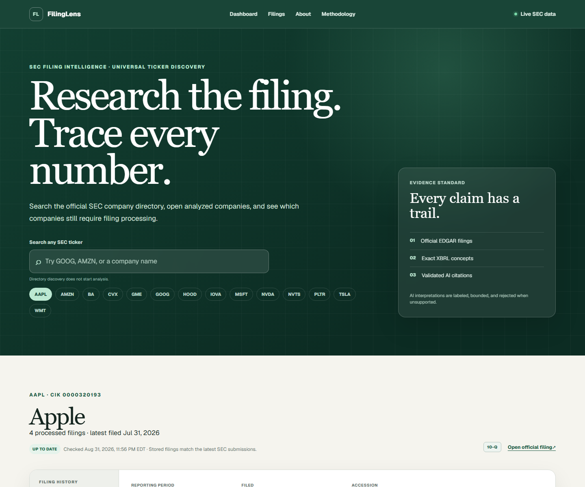
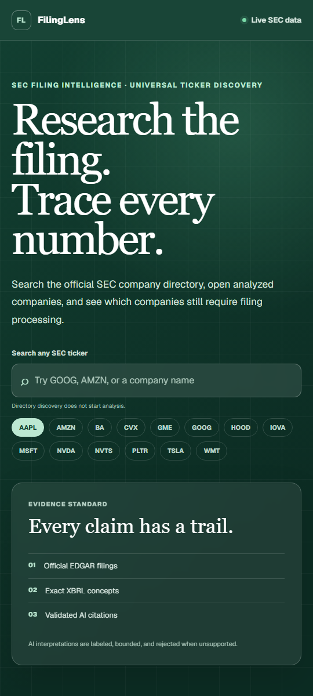

# FilingLens screenshots

These images show the public production interface after the final workers.dev address
cutover.

- `filinglens-desktop.png` — full-width dashboard view for project pages and README use.
- `filinglens-mobile.png` — narrow responsive view for portfolio presentations.

## Desktop

## Responsive

The screenshots contain public SEC filing data only. They do not include secrets,
private configuration, or Cloudflare dashboard screens.
